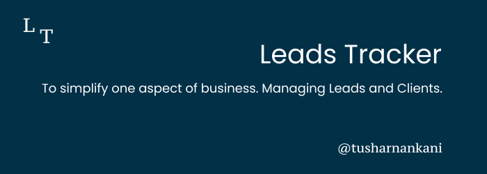
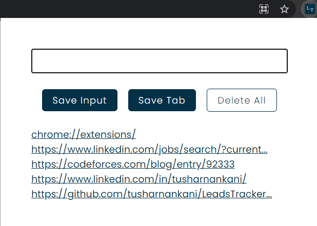
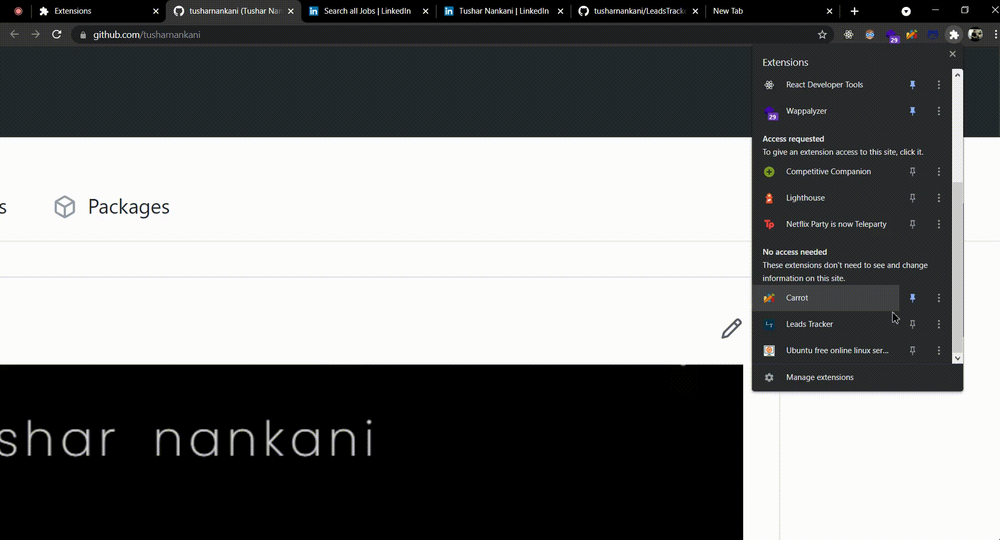

# LeadsTracker

A chrome extension to track your leads.

**Lead Tracker** is to simplify one aspect of business, managing leads and clients.

- It is a full suite lead and client tracking service.
- Keep up to date with each lead, and never miss another follow up.
- Built for ease of use and simplicty, perfect for small businesses.
- Has a hotkey to activate the extension: `Ctrl + Shift + Z`

## Using this extension

Extensions can be [loaded in unpacked mode](https://developer.chrome.com/extensions/getstarted#unpacked) by following the following steps:

- Visit `chrome://extensions` (via menu -> Tools -> Extensions).
- Enable Developer mode by ticking the checkbox in the upper-right corner.
- Click on the "Load unpacked extension." button.
- Clone the repository and select the directory - LeadsTracker, containing your **unpacked** extension.

## Motivation?

- To build my first [Chrome Extension](https://developer.chrome.com/docs/extensions/)
- To learn [Sass: Syntactically Awesome Style Sheets](https://sass-lang.com/)

## References

- [Sass - freeCodeCamp](https://www.freecodecamp.org/learn/front-end-libraries/sass/)
- [Color Palette](https://coolors.co/8ecae6-219ebc-023047-ffb703-fb8500)
- [chrome.tabs - Chrome Developers](https://developer.chrome.com/docs/extensions/reference/tabs/#get-the-current-tab)
- [window url for extensions](https://stackoverflow.com/a/17826527)
- [chrome.commands - Chrome Developers](https://developer.chrome.com/docs/extensions/reference/commands/)

### License 📜

- [MIT License](/LICENSE)

## Author

Tushar Nankani

- [LinkedIn](https://www.linkedin.com/in/tusharnankani/) | [Twitter](https://twitter.com/tusharnankanii)
